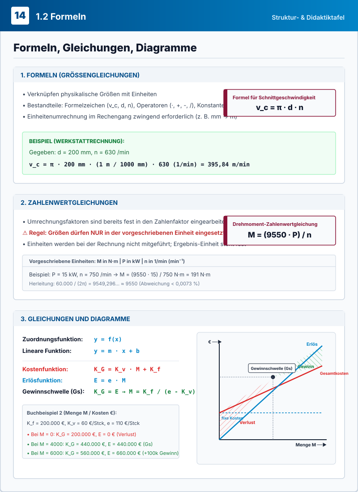

# 📐 Tabellenbuch Metall • Formeln, Gleichungen, Diagramme (S. 14)

Interaktive Web-Applikation und technischer Digitaler Zwilling basierend auf **Seite 14** des Standardwerks **Tabellenbuch Metall (48. Auflage)**, Kapitel *1.2 Formeln* (Bereich Technische Mathematik).



---

## 🌟 Übersicht & Module

Diese Anwendung transformiert die theoretischen und rechentechnischen Grundlagen der Buchseite 14 in ein vollständig interaktives Lern- und Werkstattwerkzeug:

### ⚙️ 1. Größengleichungen & Schnittgeschwindigkeit ($v_c = \pi \cdot d \cdot n$)
* **Physikalische Größengleichung**: Variablen besitzen Einheiten, die im Rechengang mitgeführt und umgeformt werden müssen.
* **3-Wege-Rechner**:
  * Schnittgeschwindigkeit $v_c = \pi \cdot d \cdot n$ (in $\text{m/min}$, $\text{m/s}$, $\text{km/h}$)
  * Spindeldrehzahl $n = \frac{v_c}{\pi \cdot d}$ (in $\text{min}^{-1}$)
  * Durchmesser $d = \frac{v_c}{\pi \cdot n}$ (in $\text{mm}$, $\text{cm}$, $\text{m}$, $\text{Zoll}$)
* **Einheitenumrechnung im Rechengang**: Vollständige algebraische Aufschlüsselung ($200\,\text{mm} \cdot \frac{1\,\text{m}}{1000\,\text{mm}} = 0{,}2\,\text{m}$).
* **Werkstoff-Richtwertkatalog**: Richtwerte für HSS- und VHM-Werkzeuge (Baustahl S235JR, C45, 11SMn30, 42CrMo4, 1.4301, AlMgSi0,5, EN-GJL-250).
* **Kinematische 2D-Canvas-Simulation**: Animiertes rotierendes Drehteil bzw. Fräswerkzeug mit dynamischem Tangentialvektor $\vec{v}_c$, Spindeldrehzahl $n$, Bemaßung $\varnothing d$ und Späneflug.

---

### ⚡ 2. Zahlenwertgleichungen & Drehmoment ($M = \frac{9550 \cdot P}{n}$)
* **Eigenschaft von Zahlenwertgleichungen**: Einheitenumrechnungen sind fest in den numerischen Faktor eingearbeitet. Strengste Einhaltung der vorgeschriebenen Einheiten:
  * $M$ in $\text{N}\cdot\text{m}$ (Drehmoment)
  * $P$ in $\text{kW}$ (Antriebsleistung)
  * $n$ in $\text{min}^{-1}$ ($1/\text{min}$, Drehzahl)
* **3-Wege-Rechner**: Berechnung von $M$, $P$ oder $n$ mit Sofort-Validierung.
* **Mathematische Herleitung des Faktors 9550**:
  $$P = M \cdot \omega = M \cdot \frac{2\pi \cdot n}{60} \implies M = \frac{60 \cdot 1000}{2\pi} \cdot \frac{P(\text{kW})}{n} = \frac{60\,000}{2\pi} \cdot \frac{P}{n} \approx \mathbf{9549{,}29658\dots} \approx \mathbf{9550}$$
  Gegenüberstellung des exakten Werts mit der Praxisformel (Fehler $< 0{,}0073\%$).
* **SVG-Motorkennlinie**: Hyperbelkurve $M(n)$ bei konstanter Leistung $P = \text{const}$ mit wanderndem Nennarbeitspunkt.

---

### 📈 3. Gleichungen und Diagramme ($y = m \cdot x + b$)
* **Lineare Funktion**:
  * $y = f(x)$
  * Steigung $m = \frac{\Delta y}{\Delta x}$
  * y-Achsenabschnitt $b$
* **Interaktives SVG-Koordinatensystem**:
  * Buchbeispiel 1 ($y = 0{,}5 x + 1$)
  * Eingezeichnetes Steigungsdreieck mit $\Delta x$ und $\Delta y$
  * Nullstellenanzeige und y-Achsenabschnittsmarker
* **Dynamische Wertetabelle**: Exakte Wiedergabe der Tabelle für $x \in \{-2, 0, 2, 3\}$.

---

### 💼 4. Kosten- und Erlösfunktion & Gewinnschwelle (Break-Even)
* **Kostenfunktion**: $K_G = K_v \cdot M + K_f$
  * $K_G$: Gesamtkosten (€)
  * $K_v$: variable Kosten pro Stück (€/Stck)
  * $K_f$: fixe Kosten (€)
  * $M$: Produktionsmenge (Stück)
* **Erlösfunktion**: $E = e \cdot M$ ($e$: Netto-Verkaufspreis pro Stück)
* **Gewinnschwelle ($M_{\text{Gs}}$)**:
  $$K_G = E \iff M_{\text{Gs}} = \frac{K_f}{e - K_v}$$
* **High-Fidelity SVG-Diagramm (wie Buchseite 14 unten links)**:
  * Horizontale gestrichelte Linie: Fixe Kosten ($K_f = 200\,000\,\text{€}$)
  * Variable Kostenfläche
  * Rote Kurve: Gesamtkosten $K_G$
  * Blaue Kurve: Erlös $E$
  * Schraffierte rote Verlustzone & grüne Gewinnzone
  * Schnittpunkt "Gewinnschwelle (Gs)" bei $M = 4000\,\text{Stück}$, $440\,000\,\text{€}$
  * Dynamischer Mengen-Cursor mit Tooltip für beliebige Losgrößen $M$.
* **Fertigungsszenarien**:
  * Buch-Beispiel 2 (Maschinenbau-Großbaugruppe)
  * CNC-Präzisionswelle (Kleinserie)
  * Spritzguss-Werkzeug (Großserie)
  * Stanz-Biegeteil (Blechfertigung)

---

### 🎓 5. Interaktiver Übungs- & Trainingsmodus
* **6 praxisnahe Prüfungs- und Werkstattaufgaben**:
  1. Drehen einer Antriebswelle ($v_c = 140\,\text{m/min}$, $d = 80\,\text{mm} \implies n = 557\,\text{min}^{-1}$)
  2. Schaftfräsen in Aluminium ($d = 16\,\text{mm}$, $n = 6000\,\text{min}^{-1} \implies v_c = 301{,}6\,\text{m/min}$)
  3. Drehstrommotor Nennmoment ($P = 7{,}5\,\text{kW}$, $n = 1450\,\text{min}^{-1} \implies M = 49{,}4\,\text{Nm}$)
  4. Getriebemotor Leistungsauslegung ($M = 350\,\text{Nm}$, $n = 120\,\text{min}^{-1} \implies P = 4{,}40\,\text{kW}$)
  5. Gewinnschwelle CNC-Auftrag ($K_f = 24\,000\,\text{€}$, $K_v = 35\,\text{€}$, $e = 95\,\text{€} \implies M_{\text{Gs}} = 400\,\text{Stück}$)
  6. Gewinnermittlung bei Losgröße $M = 1000\,\text{Stück}$ ($G = 36\,000\,\text{€}$)
* Sofortige Eingabeprüfung mit Toleranzbereich, zuschaltbarem Tipp und ausführlicher mathematischer Musterlösung.

---

### 📐 6. Didaktische Struktur- & Formeltafel (S. 14 Synopse)
* Vektorbasierte DIN/ISO-konforme Übersichtstafel (`assets/schematic-page14.svg`) der drei mathematischen Kernsäulen.
* Interaktive Hotspots auf den drei Stationen mit Direkt-Sprung in die jeweiligen Rechner und Simulationen.

---

## 💻 Technische Architektur & Ausführung

* **Technologie-Stack**:
  * Reines HTML5, CSS3, modernisiertes JavaScript (ES6+ Modules / Vanilla JS).
  * **KaTeX**: Hochpräziser, typografisch korrekter mathematischer Formelsatz.
  * **HTML5 2D Canvas**: Kinematische Schnittgeschwindigkeits- und Spanbildungsanimation.
  * **SVG**: Vektorielles Koordinatensystem und Break-Even-Diagramm mit dynamischen Schraffuren (`<pattern>`) und Tooltips.
* **Themes**:
  * **Klassik Ingenieur-Modus** (Tabellenbuch-Design mit Königsblau, Weinrot und Bernstein).
  * **Blueprint / CAD-Dunkelmodus** (Dunkles Techniker-Design für augenschonendes Arbeiten).

---

## 🚀 Starten der Anwendung

Die Anwendung kann direkt im Webbrowser geöffnet werden:
```bash
# Im Browser öffnen:
G:\My Drive\agy\demos\tbb-mathe-formeln\index.html
```

Oder über einen beliebigen lokalen Webserver:
```bash
cd "demos/tbb-mathe-formeln"
python -m http.server 8080
# Öffne http://localhost:8080 im Browser
```
